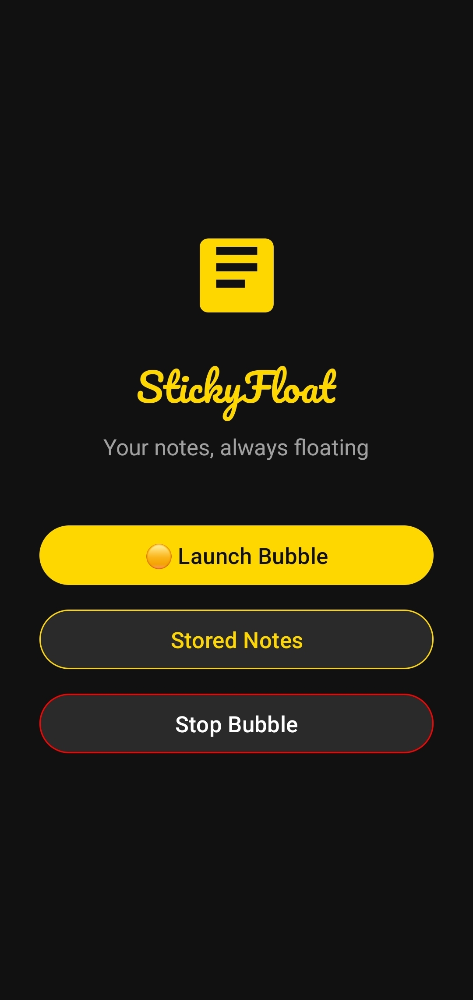
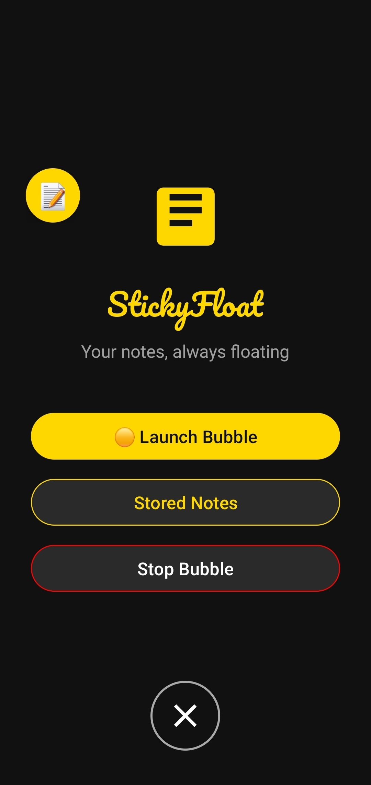
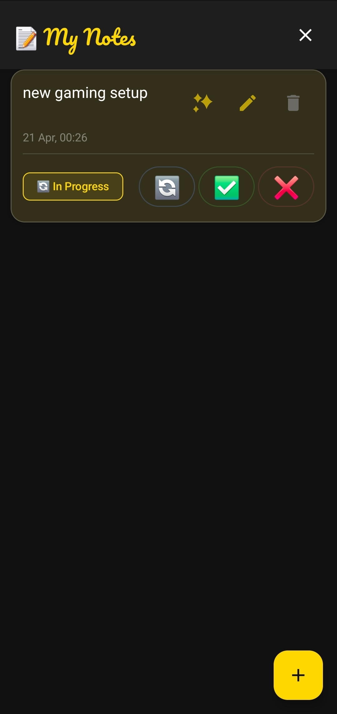
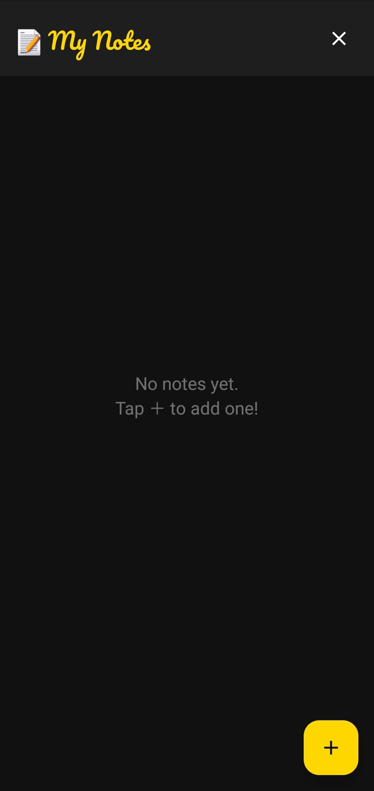
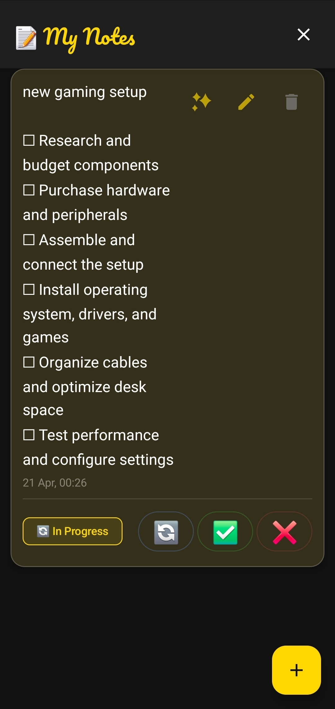
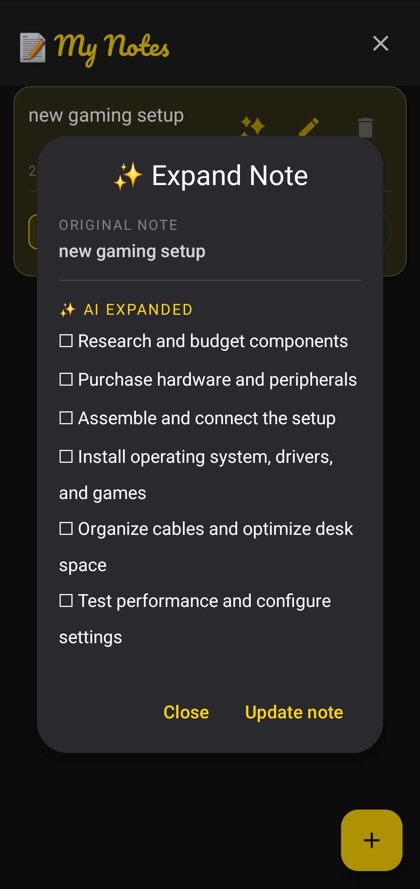

# Stickyfloat v2.0

**Stickyfloat** is a premium Android application that redefines the "Floating Sticky Notes" experience. Designed for productivity, it allows you to capture ideas, manage tasks, and view notes that "float" on top of any application. With integrated AI and a sleek, modern interface, your important information is always just a tap away.

---

## Screenshots

|                                             Home Overlay                                             |                                       Main Application                                       |                                         Note Management                                         |
|:----------------------------------------------------------------------------------------------------:|:--------------------------------------------------------------------------------------------:|:-----------------------------------------------------------------------------------------------:|
|  |  |  |

|                                          AI Note Expansion                                          |                                           Detail View                                            |                                        Smart Interactions                                         |
|:---------------------------------------------------------------------------------------------------:|:------------------------------------------------------------------------------------------------:|:-------------------------------------------------------------------------------------------------:|
|  |  |  |

|                                       Premium Dark Mode                                        |                                             Drag to Remove                                             |
|:----------------------------------------------------------------------------------------------:|:------------------------------------------------------------------------------------------------------:|
|  |  |

---

## Key Features

- **AI Note Expansion**: Integrated with **Google Gemini AI** to help you expand short notes into detailed thoughts or summaries with a single click.
- **Floating Bubble Interface**: Seamless overlay that stays on top of other apps. Move it anywhere or tap to toggle your notes.
- **Drag-to-Remove**: Intuitive gesture logic—drag the bubble to the bottom of the screen to dismiss the service instantly.
- **Forced Dark Theme**: A consistent, premium dark mode aesthetic designed for focus and eye comfort, regardless of system settings.
- **Persistent Room Storage**: Your notes are safely stored in a local SQLite database, ensuring zero data loss and instant loading.
- **High Performance**: Built with a foreground service architecture to ensure stability and responsiveness.

## Tech Stack

- **Language**: [Kotlin](https://kotlinlang.org/)
- **UI Frameworks**:
    - **Layout activities**: Modern, declarative UI for the main application.
    - **Custom WindowManager Logic**: For the high-performance floating overlay.
- **AI Integration**: [Google Generative AI SDK](https://ai.google.dev/) (Gemini Pro)
- **Database**: [Room Persistence Library](https://developer.android.com/training/data-storage/room)
- **Architecture**: MVVM (Model-View-ViewModel)
- **Threading**: Kotlin Coroutines & Flow

## Project Structure

```text
app/src/main/java/ma/project/stickyfloat/
├── data/           # Repository and Room Database (NoteDatabase.kt, NoteDao.kt)
├── model/          # Data Models (Note.kt)
├── services/       # Core Logic (FloatingBubbleService.kt, GeminiService.kt)
└── ui/             # Layouts, Themes, and Adapters
```

## Getting Started

1. **Clone & Open**:
   ```bash
   git clone https://github.com/pluto-hyp/Stickyfloat.git
   ```
   Open the project in **Android Studio (Giraffe or newer)**.

2. **API Configuration**:
    - To use the AI features, ensure you have a valid Gemini API key configured in your environment or local properties (if applicable).

3. **Permissions**:
    - Stickyfloat requires the **"Display over other apps"** permission. Launch the app and follow the prompt to enable the floating experience.

---
*Version 2.0 Stable Release*
*Created with ❤️  by Mouad El Ouichouani*
